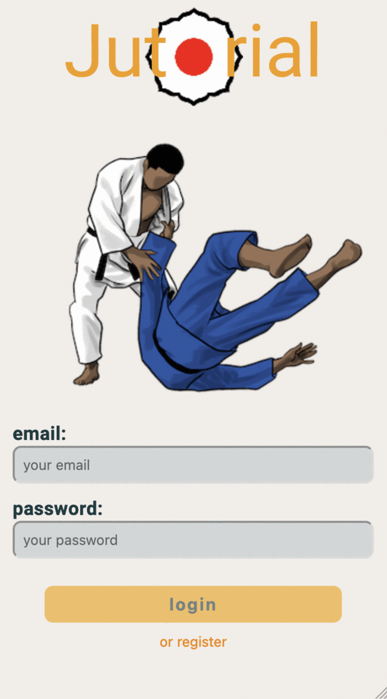

# Jutorial

With my app you can become your own sensei!
Watch the videos, get inspired and improve your technical skills to develop as a judo fighter. Use the Goals feature, challenge yourself and set new goals. With the overview you can track your goals.

This application is optimized for mobile use, so please switch your browser to responsive mode (from iPhone 6/7/8 to iPhone XR).

# Tech stack

- React
- React-Router
- React-Player
- Storybook
- Node.js
- npm
- Cloudinary
- MongoDB Atlas
- youtube
- Git Workflow

# URL

https://jutorial.herokuapp.com/

# Project setup

1. Clone this repository.

2. Install all npm dependencies `npm install`

3. To run the app in development mode `$npm run dev`, then open http://localhost:3000 to view it in the browser

4. To run Storybook `npm run storybook`

5. To run unit and component `tests npm test`

6. Create a build ready for deployment to firebase `npm run build`

#
